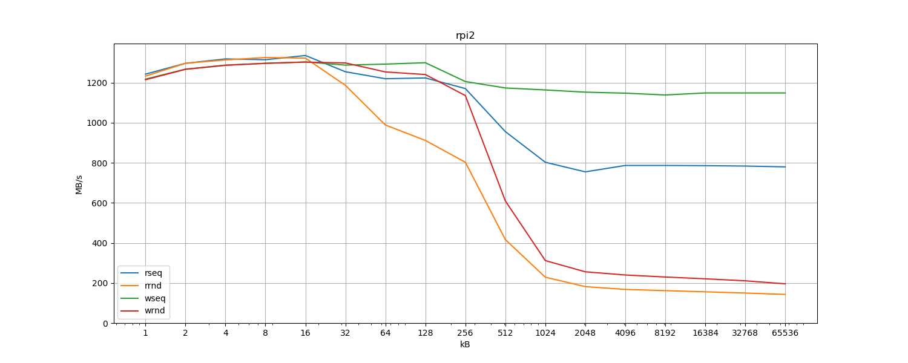

# Memory performance test

This test measures memory read and write bandwidth using sequential (labeled as 
`seq`) and random (`rnd`) access.  Comparing the results for memory chunks of 
different sizes gives some insight into CPU memory subsystem.

## Prerequisites

```
$ sudo apt install build-essential python[3]-matplotlib
```

## Usage

Run `sudo make` to produce `$HOSTNAME.log` containing measurements results for 
memory chunks of sizes 1k up to 64M. Run `make png` to plot the data from the 
log files.

## Samples

### Xiaomi Mi Router 4A (100M Edition)

- CPU: MT7628AN (MIPS 24KEc) @ 575MHz
  - L1 cache: 32k
- Memory: , x16


### Raspberry Pi v1

- CPU: BCM2835 (ARM1176JZF-S) @ 700MHz
  - L1 cache: 16k
  - L2 cache: 128k
- Memory: LPDDR2-800, x32


### Raspberry Pi v2

- CPU: BCM2836 (cortex-a7) @ 900MHz
  - L1 cache:
  - L2 cache: 256k
- Memory: LPDDR2-900, x32



### Raspberry Pi v3

- CPU: BCM2837 (cortex-a53) @ 1200MHz
  - L1 cache:
  - L2 cache: 512k
- Memory: LPDDR2-900, x32


### Raspberry Pi v4

- CPU: BCM2711 (cortex-a72) @ 1500MHz
  - L1 cache:
  - L2 cache: 1M
- Memory: LPDDR4-3200, x32


### PC

- CPU: Intel Celeron J3455 @ 2300MHz
  - L1 cache:
  - L2 cache: 2M
- Memory: DDR3-1600, x64


